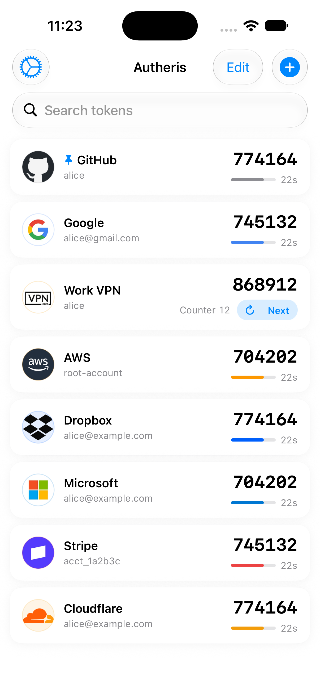
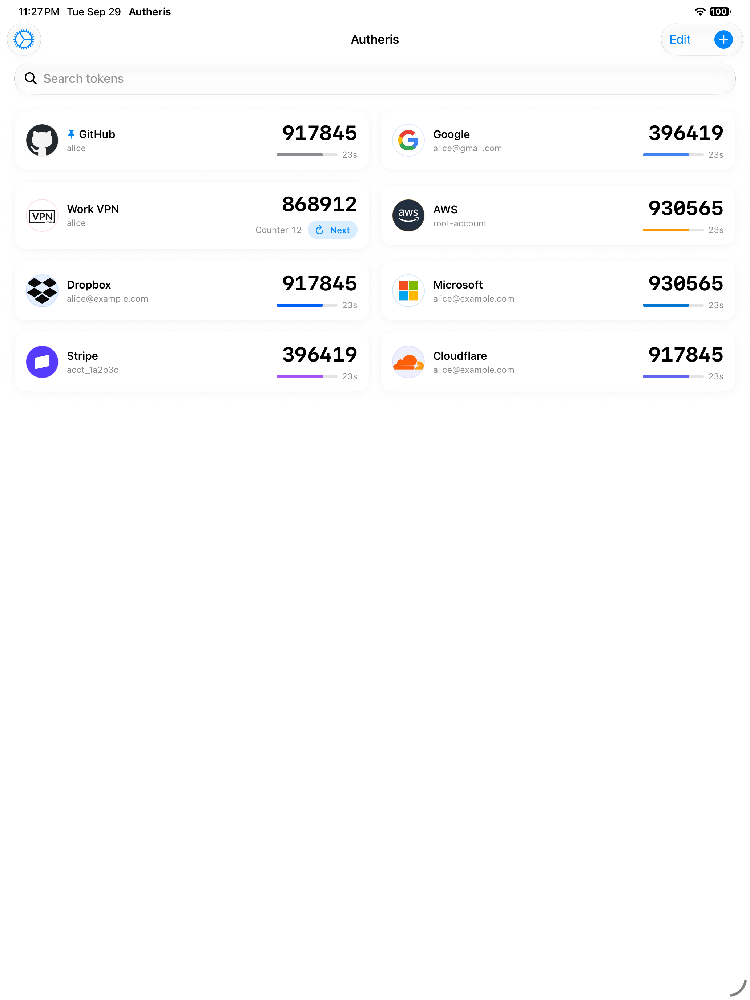
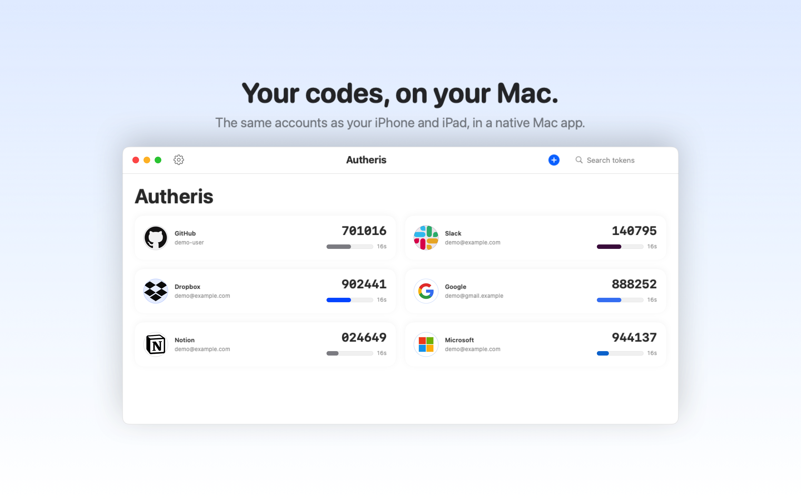
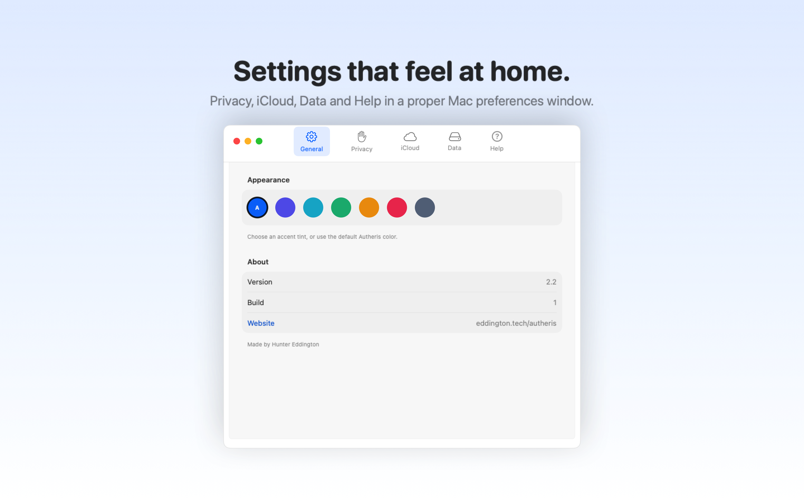
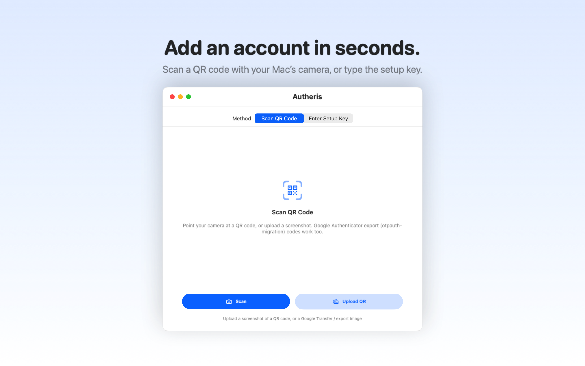
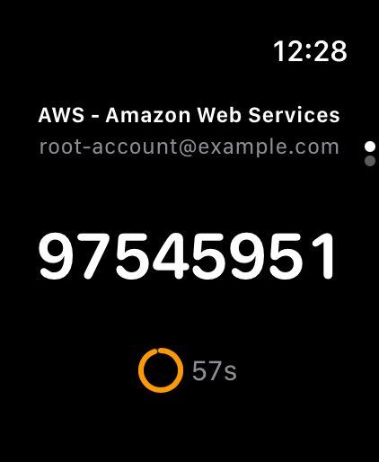

# Autheris

<p align="center">
  
</p>

<p align="center">
  <a href="https://apps.apple.com/app/id6760686327">
    
  </a>
  
  
</p>

**Autheris** is a secure, privacy-focused two-factor authentication (2FA) token manager for iPhone, iPad, Mac, and Apple Watch. Built with SwiftUI and designed with zero-knowledge architecture — your tokens never leave your device unless you explicitly choose to export them or turn on iCloud Sync.

## Tech Stack

- **Language**: Swift 5.9+
- **Framework**: SwiftUI
- **Architecture**: MVVM with Combine
- **Storage**: JSON in the Keychain (`kSecAttrAccessibleWhenUnlockedThisDeviceOnly`) — the data protection keychain on macOS, via `kSecUseDataProtectionKeychain`. See [Security](docs/security.md#security) for what this does and does not protect
- **Sync**: CloudKit private database (optional, opt-in per device)
- **Backend**: none. The app has no server of its own and stores nothing off the device. The one network call it can make is an issuer-icon lookup at `img.logo.dev`, which sends the service's *name* and is controlled by **Settings → Privacy → Fetch service logos** — see [Issuer icons](docs/security.md#issuer-icons). This entry previously read "Cloudflare Workers (optional, used for issuer logo lookups only)": that scaffold was never deployed and was deleted in 2.4 (see [Development material inside the app target](docs/development.md#development-material-inside-the-app-target)).

## Features

- 🔐 **Privacy-First Design**: Blur app content when backgrounded, hide codes in app switcher, and cover them while the screen is being recorded or mirrored
- 👁️ **Setup Key Access**: View, copy, or edit a token's secret — masked by default, tap to reveal
- ☁️ **Optional iCloud Sync**: Off by default. When enabled, tokens sync across your own devices through your private iCloud database, with secret keys end-to-end encrypted
- 📱 **Native Everywhere**: One SwiftUI codebase for iPhone, iPad, and Mac — no Catalyst, no "Designed for iPad"
- ⌚ **Apple Watch App**: Your codes on your wrist, one per screen with a live countdown. Read-only by design — no copy, no editing and no settings on the watch
- 📸 **QR Code Scanning**: Quick token setup from any 2FA QR code
- 🔢 **Time-Based and Counter-Based Codes**: RFC 6238 (`otpauth://totp/…`) and RFC 4226 (`otpauth://hotp/…`), each with SHA-1, SHA-256 or SHA-512 and 6–10 digits. A counter-based code does not expire: its card carries **Next Code**, which spends the current one and shows the next. See [Counter-based codes](docs/security.md#counter-based-codes)
- 📤 **Export & Backup**: Local backup files and QR exports you control (stored in the app sandbox, protected by the device passcode, not additionally encrypted)
- 📥 **Easy Migration**: Import from Google Authenticator, Aegis, andOTP or 2FAS — counter-based accounts included, with the counter they were on
- 🗑️ **Recently Deleted**: A deleted code stays recoverable on your device for 7 days before it is removed for good
- 📌 **Pin and Reorder**: Pin the codes you use most to the top, and drag the rest into whatever order suits you
- 🔍 **Quick Search**: Find tokens instantly
- 🎨 **Clean Interface**: Simple, distraction-free design

## Screenshots

<p align="center">
  
  
  
</p>

<p align="center">
  <sub><b>iPhone, iPad and Mac</b> — one codebase, three layouts. The third code is counter-based: it shows the counter it is on and a <b>Next</b> button instead of a countdown, because that kind of code expires when it is spent rather than when the clock ticks over.</sub>
</p>

<p align="center">
  
  
  
</p>

<p align="center">
  <sub><b>Mac and Apple Watch</b> — Settings is a real preferences window rather than a stretched phone sheet; the watch is one code per screen, read-only by design.</sub>
</p>

## Security

Everything is local. Autheris has no account, no server of its own and no analytics.

- **Your codes live on this device**, in the system Keychain, protected by your passcode and Face ID / Touch ID, and marked “this device only” so they never travel through an iCloud or iTunes backup.
- **Nothing leaves without permission.** iCloud Sync is off by default. Switched on, it uses your own *private* iCloud database with the secrets end-to-end encrypted — there is no copy on any server of ours to read.
- **It is covered when it matters.** Codes blur in the app switcher, hide whenever the screen is being recorded or mirrored, and the app re-locks 30 seconds after you leave it.
- **A copied code does not wander.** It is marked concealed so Universal Clipboard does not carry it to your other devices, and the clipboard clears itself after 60 seconds.
- **A backup is yours to protect.** Encrypted with a password you choose (AES-256-GCM), or plain if you would rather — the choice is explicit either way.
- **It will not hand you a wrong code quietly.** A counter-based code is read as counter-based, rather than as a time-based one the service would reject.

[How each of those is enforced — and the two things it deliberately does not cover](docs/security.md): a screenshot, and a device that is fully compromised.

### The one request it can make

Looking up a service's *icon* by name is the only thing Autheris asks the network for. It sends the service's name, never your code, and **Settings → Privacy → Fetch service logos** turns it off. [What that discloses, precisely](docs/security.md#issuer-icons).


## Documentation

The engineering behind all of that lives in [`docs/`](docs/):

| Document | What is in it |
| --- | --- |
| [`docs/security.md`](docs/security.md) | The threat model in detail: where tokens live, what the privacy screen covers, what iCloud Sync sends, issuer icons |
| [`docs/icloud-sync.md`](docs/icloud-sync.md) | Sync rules, the CloudKit container, and deploying the schema |
| [`docs/platforms.md`](docs/platforms.md) | The Mac and Apple Watch apps, and how they differ from the phone |
| [`docs/development.md`](docs/development.md) | Tests, localisation, and the pitfalls of a synchronised app folder |
| [`docs/releasing.md`](docs/releasing.md) | Archiving, exporting, submitting, and the steps that fail quietly |

## Installation

```bash
git clone https://github.com/nerdykidtech/Autheris.git
cd Autheris
open Vaultic.xcodeproj
```

Requires the iOS 26, macOS 26 and watchOS 26 SDKs (Xcode 26 or later). The Mac app also needs a Mac provisioning profile for `com.eddingtontech.autheris` — signing in with an Apple ID and building once with `-allowProvisioningUpdates` (or just ⌘R in Xcode) creates it.

## Download

<a href="https://autheris.app">
  
</a>

**[Get it at autheris.app](https://autheris.app)**

## Privacy Policy

View our privacy policy at [autheris.app/privacy](https://autheris.app/privacy)

## License

MIT License — see [LICENSE](./LICENSE) for details.

## Author

Built by [Hunter Eddington](https://eddington.tech) — System Engineer & IAM Engineer specializing in identity and access management.

---

<p align="center">
  <sub>Open source 2FA for iOS. No accounts. No tracking. Your tokens, your device.</sub>
</p>
